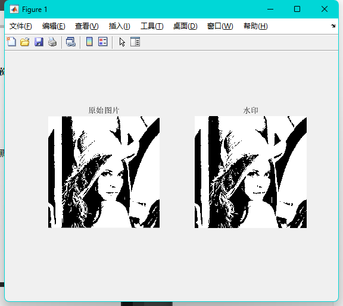
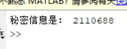

# 实验八 二值图像隐藏法实验

学号：2110688 姓名：史文天 专业：信息安全

## 实验要求

1、隐藏：利用二值图像隐藏法，实现将秘密信息（可以是图像、文字等信息）嵌入到位图中；

2、提取：将秘密信息提取出来。

## 实验原理

1. #### 划分：

     将原图划分为1x4 的矩阵像素块，每个区域有连续四个像素点。像素点取值情况共有5 类：全白，1 个黑像素点，2 个黑像素点，3 个黑像素点和全黑。

2. #### 嵌入：

     如果要嵌入0，需要嵌入后为三黑一白，对应五种情况的处理：全白，不处理视为无效块，一黑，两黑，全黑改为三黑，三黑不用改。如果要嵌入1，需要嵌入后为一黑三白，对应五种情况的处理：全白，两黑，三黑改为一黑三白，一黑不用改，全黑，视为无效块。

3. #### 提取：

     每四个像素点为一块，检测其中黑像素点个数。若是三个黑色，则秘密图像中对应位置为黑色，若是一个黑色（即三个白色），则对应白色。如果是全黑，说明在隐藏时要隐藏白色，如果是全白，说明隐藏时要隐藏黑色。

## 原图像展示


## 实验步骤

### 工具函数CalculateBlack


```matlab
%% CalculateBlack
function out = CalculateBlack(x, i)
out = 0;
for a = i : i + 3
    if x(a) == 0
        out = out + 1;
    end
end
end
```

- 函数的作用是计算x 中从第i 个元素开始的连续4 个元素中，值为0 的元素个数，并将结
  果返回。该函数以四格为单位遍历原始图像然后输出黑色像素的数量。

### 秘密信息嵌入


```matlab
d = imread('./pic.bmp');
d = im2bw(d);
imwrite(d, 'black1.bmp', 'bmp')
subplot (1, 2, 1); imshow (d, []); title (' 原始图片 ');
secret = 2110688;

for t = 1:25
    s(t) = bitget(secret, t);
end
```

- 首先读取图片并转换为二值图像，然后就是将秘密信息（2110688）进行加密。
- 然后，使用bitget() 函数将学号进行二进制提取。

```matlab
num = 1;
t = 1;

while t < 25
    if s(t) == 0
        switch (CalculateBlack(d, num))
            case 0
                t = t - 1;
                num = num + 4;
            case 1
                temp = 1;
                startnum = num;
                while temp < 3
                    if d(startnum) == 1
                        d(startnum) = 0;
                        temp = temp + 1;
                        startnum = startnum + 1;
                    end
                end
                num = num + 4;
            case 2
                temp = 2;
                startnum = num;
                while temp < 3
                    if d(startnum) == 1
                        d(startnum) = 0;
                        temp = temp + 1;
                        startnum = startnum + 1;
                    end
                end
                num = num + 4;
            case 3
                num = num + 4;
            case 4
                temp = 4;
                startnum = num;
                while temp > 3
                    if d(startnum) == 0
                        d(startnum) = 1;
                        temp = temp - 1;
                        startnum = startnum + 1;
                    end
                end
                num = num + 4;
        end
    else
        a = CalculateBlack(d, num)
        switch a
            case 0
                temp = 4;
                startnum = num;
                while temp > 3
                    if d(startnum) == 1
                        d(startnum) = 0;
                        temp = temp - 1;
                        startnum = startnum + 1;
                    end
                end
                num = num + 4;
            case 1
                num = num + 4;
            case 2
                temp = 2;
                startnum = num;
                while temp < 3
                    if d(startnum) == 0
                        d(startnum) = 1;
                        temp = temp + 1;
                        startnum = startnum + 1;
                    end
                end
                num = num + 4;
            case 3
                temp = 1;
                startnum = num;
                while temp < 3
                    if d(startnum) == 0
                        d(startnum) = 1;
                        temp = temp + 1;
                        startnum = startnum + 1;
                    end
                end
                num = num + 4;
            case 4
                t = t - 1;
                num = num + 4;
        end
    end
    t = t + 1;
end
```

- 首先需要判断嵌入的秘密信息是0 还是1，如果是0 的话就需要三个黑色像素点和一个白色像素点。这一步可以通过实现定义好的CalculateBlack 函数进行获取。
- 如果输出了0，那么我们就知道这个信息块是白色，应该是无效块。此时应当访问下一个矩阵。
- 如果是1 的话那么就将其中的两个白色像素点修改为黑色。
- 依次类推，保证这个像素块中由三个黑色的像素点。同理，如果是嵌入信息是1，则我们需要将其修改为三白一黑，原理与上一种情况类似。

### 秘密信息提取

```matlab
%% decode
clc;
clear;
d = imread('black2.bmp');

for t = 1:25
    s(t) = bitget(0, t);
end

t = 1;
num = 1;

while t < 25
    a = CalculateBlack(d, num);
    switch a
        case 0
            num = num + 4;
        case 1
            s(t) = 1;
            t = t + 1;
            num = num + 4;
        case 3
            s(t) = 0;
            t = t + 1;
            num = num + 4;
        case 4
            num = num + 4;
    end
end

sum = 0;

for t = 1:25
    sum = sum + s(t) * 2^(t - 1);
end

fprintf("秘密信息是： %d\n", sum);
```

- 首先读取图片，初始化存放密文的矩阵。
- 然后进行提取操作，如果我们已知长度为8，所以可以将遍历的步长设置为8，然后计算其中黑色像素的数量，为0 或4 时代表为无效块，黑色为1 时代表为1，黑色为3 时代表为0。
- 最后将2 进制转换为10 进制即可。

## 实验结果



可以看到，嵌入秘密信息的图像与原图没有肉眼可见的差别。

运行秘密信息提取函数，看到如下结果。



正确提取出了图片中的秘密信息。

## 实验总结

通过这次实验，我验证了二值图像隐藏法的有效性，通过将秘密信息嵌入到载体图像进行隐藏，实现了在传输过程中不引起明显变化。二值图像隐藏法是一种简单有效的信息隐藏技术，可以用于保护敏感信息的隐私和安全。在实践中，需要注意控制隐藏对象的大小和容量与秘密信息的匹配，以及图像行列的动态变化。