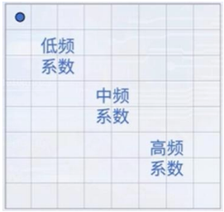
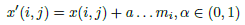
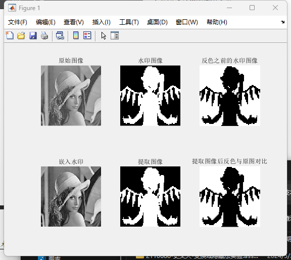

# 实验九 变换域隐藏法实验

学号：2110688 姓名：史文天 专业：信息安全

## 实验要求

 DCT域的信息隐藏包括：1. 修改系数方法；2. 系数比较方法。

以上两种方法任选一种，实现变换域中的信息隐藏与提取。

## 实验原理

DCT域的信息隐藏在载体的显著区域隐藏信息，比LSB 方法能够更好地抵抗攻击，而且保持了对人类感观的不可察觉性。常用的变换域方法：离散余弦变换DCT，离散小波变换DWT，离散傅里叶变换DFT。

### 二维DCT 变换

图像分为8x8 的像素块，进行二维DCT 变换，得到8x8 的DCT 系数。

最左上角的系数是直流系数其余是交流系数。

左上角部分是直流和低频，右下角部分是高频，中间区域是中频。

中低频系数包含了图像的大部分能量，是对人的视觉最重要的部分。



### 修改系数方法

DCT 域修改的系数一般都是中频系数，我们可以在这些中频系数中叠加所需的秘密信息。其算法二原理为：在选中的中频系数中叠加秘密信息，成比例修改DCT 系数。



其中，a 是可调参数，控制嵌入强度。与算法一相比，每个系数上嵌入的强度大小会有所不同，和原始系数比例相关。

其中x′(i, j) 和x(i, j) 分别为DCT 系数和隐藏后的系数，α 是一个超参数用以控制嵌入的强度，mi 就是第i 个信息比特。

实验将通过修改图片的方式嵌入秘密信息，然后将新的图片与原图进行比较来提取秘密信息。此外所有的图片都应该是位图。

## 原图像展示


## 实验步骤

### 秘密信息嵌入


```matlab
clc;clear all;close all;
img = (imread('./raw.bmp'));
watermark = imbinarize(imread('./NKU.bmp'));
img = imresize(img, [256, 256]);
watermark = imresize(~watermark, [64,64]);
```

- 将原始图像和水印图像进行处理，以便后续的图像水印嵌入操作。
- 随后划分块block 并在而每一个块的某一个特定位置修改DCT 系数，嵌入秘密信息。
- 嵌入水印，逐块进行扫描。

```matlab
img = double(img)/256;
watermark = im2double(watermark);
size = 256; width = 4;

blocks = size / width;
new_image = zeros(size);
vec = ones(64);

for i = 1 : blocks
    for j = 1 : blocks
        x = (i - 1) * width + 1;
        y = (j - 1) * width + 1;
        cur = img(x:x+width-1, y:y+width-1);
        cur = dct2(cur);
        
        if watermark(i, j) == 0
            a = -1;
        else
            a = 1;
        end
        
        cur(1, 1) = cur(1, 1) * (1 + .01 * a) + .01 * a;
        cur = idct2(cur);
        new_image(x: x + width - 1, y : y + width - 1) = cur;
    end
end
```

- 使用两个for 循环，分别遍历了图像中的每个小块，并对其进行处理。
- 具体来说，对于每个小块，首先使用DCT 变换将其转换为频域，然后根据水印图像的值，对小块的第一个系数进行微调，以嵌入水印信息。
- 最后，使用IDCT 变换将小块转换回空域，并将其存储到新的图像中。

### 秘密信息提取

```matlab
for i = 1 : blocks
    for j = 1 : blocks
        x = (i - 1) * width + 1;
        y = (j - 1) * width + 1;
        
        if new_image(x, y) > img(x, y)
            vec(i, j) = 1;
        else
            vec(i, j) = 0;
        end
    end
end
```

- 使用两个for 循环，分别遍历了图像中的每个小块，并对其进行处理。
- 具体来说，对于每个小块，首先比较其在原始图像中的第一个像素值和在提取出的图像中的第一个像
  素值的大小关系，如果前者大于后者，则将vec(i,j) 赋值为1，否则赋值为0。

## 实验结果



可以看到，嵌入秘密信息的图像与原图没有肉眼可见的差别。并且正确提取出了图片中的秘密信息。

## 实验总结

通过这次实验，我验证了变换域隐藏法的有效性，通过将水印信息嵌入到图像的DCT 变换系数中，从而实现对图像的保护和认证。变换域隐藏法是一种简单有效的信息隐藏技术，可以用于保护敏感信息的隐私和安全。在实验中，我使用MATLAB语言编写了相关的代码，并对图像进行了嵌入水印和提取水印的操作。通过这个实验，我深刻地认识到了图像水印技术的重要性和应用价值。