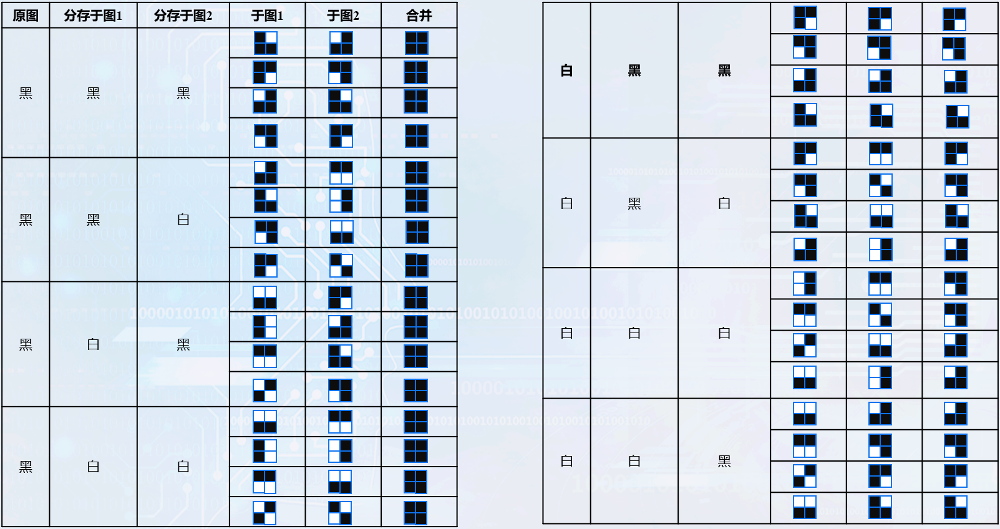

# 1.1 什么是信息隐藏

## 何谓信息隐藏？

所谓信息隐藏的意思就是将秘密信息秘密地隐藏于另一非机密的文件内容之中。其形式可为任何一种数字媒体，如图像、声音......

**信息隐藏的首要目标是隐藏的技术要好，**也就是使加入隐藏信息后的媒体目标的降质尽可能小，达到令人难以察觉的目的。  

**鲁棒性。**必须考虑隐藏的信息在经历各种环境、操作之后而免遭破坏的能力。

**信息隐藏的数据量与隐藏的免疫力始终是一对矛盾**，不存在一种完全满足这两种要求的隐藏方法，实现起来难度较大，十分具有挑战性。

## 信息隐藏技术和密码技术的区别

密码技术将明文加密成他人看不懂的密文。

信息隐藏技术提供了一种有别于加密的安全模式，其安全性来自于对第三方感知上的麻痹性。

传统的密码技术与信息隐藏技术并不是互相矛盾、互相竞争的技术，而是有益的相互补充，在实际应用中可以相互配合。

## 名词术语

### 信息隐藏(Information Hiding)

通过对载体进行难以被感知的改动，从而嵌入信息。

### 隐写术(Steganography)：

隐写术是通过对载体进行难以被感知的改动，从而嵌入秘密信息的技术。

Steganography来自于希腊词根：steganos和graphie。Steganos指有遮盖物的；graphie指写。因此，Steganography的字面意思即为隐写。

### 数字水印(Digital Watermarking)

是通过对载体进行难以被感知的改动，从而嵌入与载体有关的信息，嵌入的信息不一定是秘密的，也有可能是可见的。

### 隐写分析(Steganalysis)

是检测、提取、破坏隐写对象中秘密信息的技术。

# 1.3 发展现状和分类

## 1.3.1 研究课题

### 正向研究

基于图像的隐写和数字水印技术较成熟

基于音频的隐写和数字水印技术还在发展

视频隐写和数字水印的研究是新兴的热点

### 逆向研究

主动攻击：在不显著影响使用价值前提下，尽量抹除信息

被动攻击：判定并提取待检测载体中信息

### 新研究点

Benchmark（Stirmark），数字图像取证，感知哈希

### 理论研究

容量研究（博弈法、信息论法）

## 1.3.2 伪装式保密通信

隐藏载体：利用多媒体信息作为隐藏载体。

人的感觉系统对图像、视频、声音等的感知的精确度远远低于计算机的精确度，利用这一特点，发展出了伪装式保密通信这一研究领域。

目前这一研究领域主要研究图像、视频、声音以及文本中的隐藏信息。

### 可视密码学

其思想是把要隐藏的密钥信息通过算法隐藏到两个或多个子密钥图片中，每一张图片上都有随机分布的黑点和白点，把所有的图片叠加在一起，则能恢复出原有的信息。

## 1.3.3 数字水印

数字水印是嵌入在数字作品中的一个版权信息，它可以给出作品的作者、所有者、发行者以及授权使用者等版权信息。

### 用于版权保护的数字水印

将版权所有者的信息作为数字水印，嵌入在要保护的数字多媒体作品中，从而防止其他团体对该作品宣称拥有版权。

具有不可察觉性、稳健性、唯一性等要求。

抵抗一些正常的数据处理和恶意的攻击。

### 用于盗版跟踪的数字指纹

数字指纹与数字水印的区别：**数字水印代表的是产品的作者信息，而数字指纹主要含有的是产品购买者的信息。**

同一个产品被多个用户买去，在每一个用户买到的复件中，都预先被嵌入了包含购买者信息的数字指纹，该数字指纹对于跟踪和监控产品在市场上的非法复制是非常有用的。

数字指纹除了应具有数字水印所普遍具有的特性之外，还应该能够抵抗共谋攻击。

### 用于复制保护的数字水印

我们希望数字水印最终能够达到这样一个目的: 对于嵌入了数字水印的产品，经正常授权的用户可以无障碍地使用，而对于非授权的用户(或非法复制、盗版的产品)，该产品则无法正常使用。

在某些应用中，复制保护是可以实现的。

# 1.4 信息隐藏算法性能指标

## 透明性

信息隐藏的首要特性是透明性，也称为不可感知性，透明性是指嵌入的秘密信息导致隐写载体信号质量变化的程度。即在被保护信息中嵌入数字水印后应不引起原宿主媒体质量的显著下降和视听觉效果的明显变化，不能影响隐写载休的正常使用。也就是说隐写载体如果仅仅是通过人类听觉或者视觉系统很难察觉有异常。

## 鲁棒性

鲁棒性也称稳健性，是指隐藏的秘密信息抵抗各种信号处理和攻击的能力，鲁棒性水印通常不会因常见的信号处理和攻击而丢失隐藏的水印信息。

## 隐藏容量

隐藏秘密信息的容量指在单位时间或一幅作品中能嵌入水印的比特数。

- 对于一幅图片而言，数据容量是指嵌入在此幅图像中的所有比特数。

- 对于音频而言，数据容量即指一秒传输过程中所嵌入秘密信息的比特数。

- 对于视频而言，数据容量既可指每一帧中嵌入的比特数，也可指每一秒内嵌入的比特数。

# 1.5 可视密码学

## 灰度图像可视密码技术实现

半色调图像通常是指经过特殊加工后的印刷品上的由浅到深或由淡到浓的色调变化是由网点大小来表现的，由于网点在空间上是有一定距离而呈离散型分布的，并且由于加网的级数总有一定的限制，在图像的层次变化上是不能象连续调图像一样实现无极变化，故称为半色调图像。

### 误差扩散法

误差扩散法的基本思想：先阈值量化图像像素，然后将图像量化过程中产生的误差分配给周围像素点。利用这种方法所生成的半色调图像能够比较忠实地反映图像的灰度层次过渡。

灰度图像是具有多个灰度等级层次丰富的连续调图像，每个像素点用8比特表示，取值为0～255。  

如果输入的像素值小于等于127（比较接近黑色），则输出0（黑色）；

如果输出的像素值大于127（比较接近白色），则输出255（白色）。

按照下式计算误差:
$$
误差=输入像素值-输出
$$
将误差扩散到像素的4个待处理的邻点，分别是右方、右下方、正下方和左下方像素点。

| **……** | **X** | **X** | **X**  | **X** | **X** | **……** |
| ------ | ----- | ----- | ------ | ----- | ----- | ------ |
| ……     | X     | X     | P(i,j) | 7/16  |       | ……     |
| ……     |       | 3/16  | 5/16   | 1/16  |       | ……     |
| ……     |       |       |        |       |       | ……     |

## 彩色图像可视密码技术实现

将彩色图像的每个分量当做一张图片来处理，即把一张彩色图像看做红、绿、蓝三个分量上的三张图片。对每一张图片按照“灰度图像”进行半色调处理，然后对每一张图片进行信息分存。R、G、B分量分别分存到两张子图中，最后将得到的子图进行合并可以得到两张彩色子图。

# 1.6 叠像术

### 二值图像叠像术

我们选取两张和原图尺寸一样的图片来隐藏。原始图像像素点可能为黑或白，分存原始子图1像素点可能为黑或白，分存原始子图2像素点也可能为黑或白。

#### 2*2信息分存方案

### 灰度图像叠像术

首先，我们将要隐藏的灰度图像和用于掩饰的两张灰度图像进行半色调处理。之后可以参照二值图像叠像术的实现。

### 彩色图像叠像术

把红、绿、蓝三个分量分开考虑，把每一个分量看成一张图片，再按照灰度图像叠像术技术进行处理。