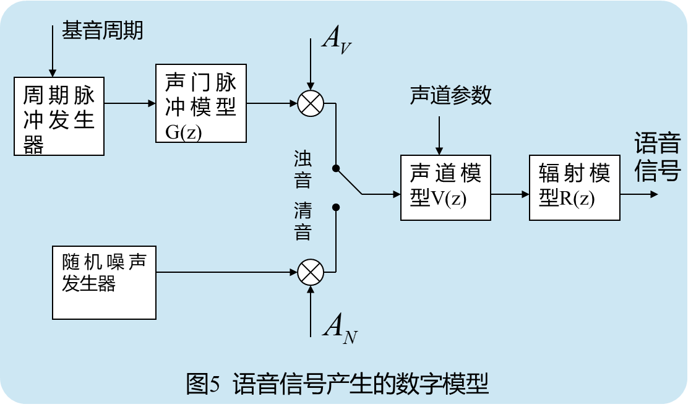
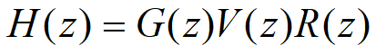
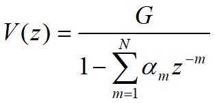
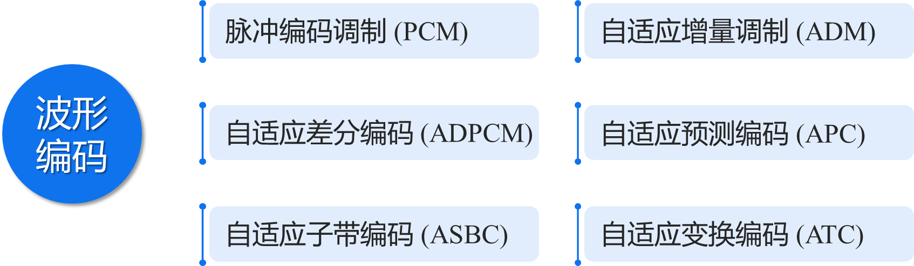
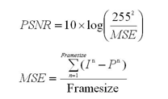

# 2.1 信号处理基础知识

## 2.1.1 人类对语言的认识

- 语言学：研究语音中各个音的排列规则及其含义，包括重音、语调、声调等（各国语言，各民族语言，地方方言等）

- 语音学：研究语音信号是由哪些最基本的单位组成的，发声器官是如何发出声音的，建立语音产生模型，便于人类对语音信号的特性进行研究

### 语音的产生及数字模型

语音的数字模型是一个缓慢时变的线性系统，在10~20ms的时间内是时不变系统 

### 完整数学模型

参数：声道参数αm，*G* ，基音周期，*Av*、*AN*以及清浊音判别等都是随时间而缓慢变化的

## 2.1.2 听觉系统和语音感知

### 掩蔽效应

当人耳听到两个强度不同的声音时，强的声音的频率成分会影响人耳对弱的声音的频率成分的收听。

- #### **频率掩蔽**

  通常，低音容易掩蔽高音，而高音掩蔽低音较难。

- #### **时间掩蔽**

  强声音后面的弱音容易被掩蔽（滞后掩蔽）；强声音前面的弱音也容易被掩蔽（超前掩蔽）。

- #### **噪音对单音的掩蔽**

  一个单音可以被以它为中心频率，具有一定频带宽度的连续噪音所掩蔽（同时掩蔽）。

#### **噪音掩蔽的临界带宽**

如果在这一频带内噪声功率等于该纯音的功率，这时该纯音处于刚能被听到的临界状态，则称这一带宽为临界带宽。

### 影响语音清晰度的主要因素

#### 对语音的掩蔽作用

对于纯音掩蔽而言,低频纯音对语音的掩蔽要大于高频纯音。

#### 频率选择性

虽然语音信号的大部分功率包含在低频分量之中，但是它们对清晰度的贡献并不是很大。

去掉高频成分对于辅音清晰度影响大。

去掉低频成分对于元音清晰度影响大。

#### 限幅

**峰值削波**：将幅度超过某一门限的值限制在门限上

**中心削波**：将幅度小于某一门限的值置为零

语音信号中的大部分信息都保存在其低幅值的部分。

## 2.1.3 语音的质量评价

清晰度：衡量语音中的字、单词和句子的清晰程度

自然度：衡量通过语音识别讲话人的难易程度

### 主观评价方法

平均意见分（MOS：Mean Opinion Score）：用5级评分标准来评价语音的质量（极好、较好、一般、较差、极差）。全体实验者的平均分就是所测语音质量的MOS分。

### 客观评价方法

对输入和输出语音信号进行分析和处理，从中提取出一些特征参量作为研究对象，最后设计一个“失真距离”，这个失真距离值跟提取出来的特征参量有关并由这些参量完全决定，以此“失真距离”值作为语音质量的客观评价值。

# 2.2 语音信号处理基础

## 语音编码的分类

### 波形编码

力图使重建的语音波形保持原语音信号的波形形状。

特点：话音质量好，但编码速率比较高 (64－16kb/s)。

### 参数编码

通过对语音信号特征参数的提取并编码，力图使重建的语音信号具有较高的可懂度，而重建的语音信号波形与原始语音波形可以有很大的差别。

特点：编码速率低，它可以达到2.4kb/s甚至更低，能够达到听懂话音，但是其主要问题是语音的自然度较低。

## 常用语音处理算法

### 离散傅立叶变换

把时域波形分解成许多不同频率的正弦波的叠加和。

傅立叶变换反映的是整个时间段中信号的频谱特性，信号任何时刻的微小变化都会影响到整个频谱。

任何有限频段上的信息都无法反映时域的某一个时间段的信号。

**不适合：时变的、非平稳信号。**

### 短时傅立叶变换 (STFT)

对于时变的、非平稳信号，用窗口取得某一时间段的信号，再分析其频谱。

取较窄的时间窗，可以得到较好的时间分辨率，但是其频率分辨率降低。

取较宽的时间窗，可以得到较高的频率分辨率，但是时域信号的细节特性就无法分辨。

**无法同时满足时间分辨率和频率分辨率的要求。**

### 小波变换(Wavelet Transform)

一种窗口大小（即窗口面积）固定但其形状可变的时—频局部化分析方法。

在低频部分具有较高的频率分辨率，较低的时间分辨率。

在高频部分具有较高的时间分辨率，较低的频率分辨率。

**符合低频信号变化缓慢而高频信号变化迅速的特点，因此，被称为数学显微镜。**

# 2.3 人类视觉特点

## 图像的质量评价

### 主观评价

让观察者根据一些事先规定的评价尺度或自己的经验，对测试图像按视觉效果提出质量判断，并给出质量分数，对所有观察者给出的分数进行加权平均。这种方法称为平均意见分（MOS）方法 。

### 客观评价

常用的有 ①均方误差（MSE）   ②峰值信噪比（PSNR） 

Peak： 8 bits 表示法的最大值255;

MSE 指 Mean Square Error;

In指原始影像第n个pixel 值;

Pn指经处理后的影像第n个pixel 值;

PSNR 的单位为dB。

PSNR值越大，就代表失真越少。

# 2.4 图像信号处理基础

## 常见图像类型

- 灰度图像：灰度值

- 彩色图像：三个矩阵，分别代表RGB三种颜色的大小

- 调色板图像：单独保存一个调色板（如256色调色板，每一个序号代表一个颜色），图像矩阵由这些序号组成

- 二值图像：只有黑、白两种颜色

## 常用图像处理方法

- 二维离散傅氏变换

- 二维离散余弦变换

- 二维离散小波变换