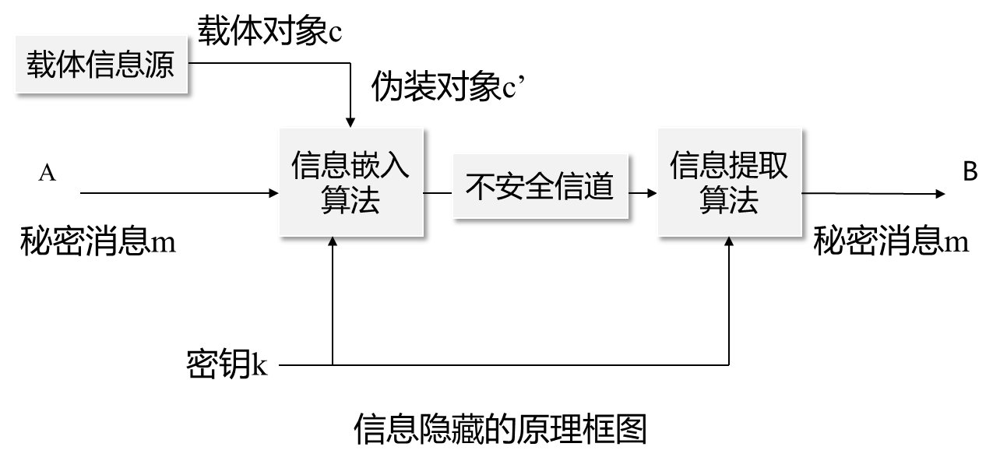
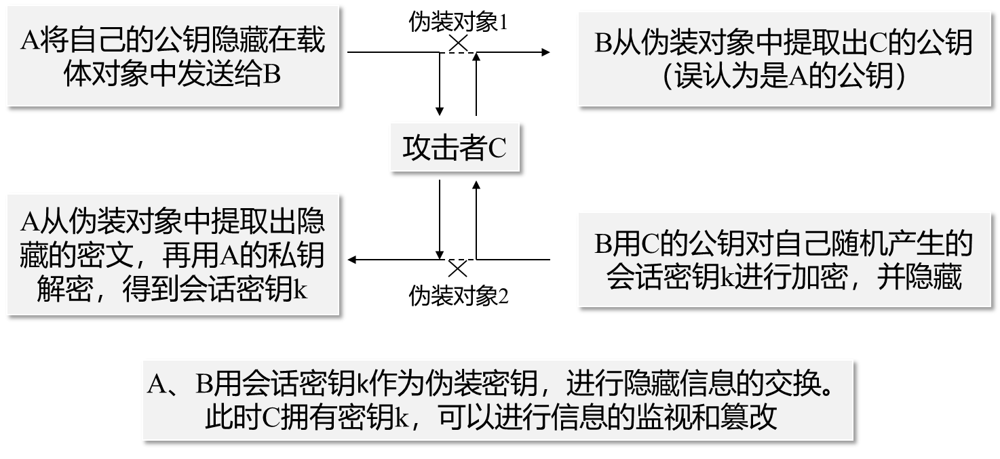
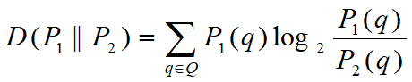
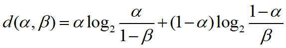

# 3.1 信息隐藏的概念

## 名词

### 载体对象：

A打算秘密传递一些信息给B，A需要从一个随机消息源中随机选取一个无关紧要的消息c，当这个消息公开传递时，不会引起怀疑，称这个消息c为**载体对象。**

### 伪装对象：

把需要秘密传递的信息m隐藏到载体对象c中，此时，载体对象c就变为**伪装对象**c' **。** 

## 伪装密钥：

秘密信息的嵌入过程需要密钥，此密钥称为**伪装密钥。** 

## 基本要求

载体对象是正常的，不会引起怀疑

伪装对象与载体对象无法区分，无论从感观上，还是从计算机的分析上

**不可视通信的安全性取决于第三方有没有能力将载体对象和伪装对象区别开来**

对伪装对象的正常处理，不应破坏隐藏的信息

# 3.2 信息隐藏的分类

## 无密钥信息隐藏

对一个五元组Σ=〈C，M，C’，D，E〉，其中C是所有可能载体的集合，M是所有可能秘密消息的集合，C’是所有可能伪装对象的集合。E：C×M→C’是嵌入函数，D：C’→M是提取函数，若满足性质：对所有m∈M和c∈C，恒有：D(E(c，m))=m，则称该五元组为无密钥信息伪装系统。

隐藏过程：映射*E：C×M→C’*

提取过程：映射*D：C’→M*

## 私钥信息隐藏

对一个六元组Σ=〈C，M，K，C’，DK，EK〉，其中C是所有可能载体的集合，M是所有可能秘密消息的集合，K是所有可能密钥的集合，EK：C×M×K→C’是嵌入函数，DK：C’×K→M是提取函数，若满足性质：对所有m∈M，c∈C和k∈K，恒有：DK (EK (c，m，k)，k)=m，则称该六元组为私钥信息隐藏系统。

通信各方使用约定的公钥体制，各自产生自己的公开钥和秘密钥，将公开钥存储在一个公开的数据库中，通信各方可以随时取用，秘密钥由通信各方自己保存，不予公开。

## 中间插入攻击

# 3.3 信息隐藏的安全性

理论安全的：如果攻击者经过各种方法仍然不能判断是否有信息隐藏,那么这个系统可以认为是理论安全的。

## 衡量两个概率分布的一致性——熵

*P1*：真实概率分布

*P2*：假设概率分布

当*P1*与*P2*完全相同时，熵D为零，说明假设的与真实的概率分布之间没有不确定性

当*P1*与*P2*不同时，D给出了假设的与真实的概率分布之间不确定性的衡量，*P1*和*P2*之间差别越大，熵越大

## 绝对安全性

设∑是一个信息伪装系统，PS是伪装对象的概率分布，PC 是伪装载体的概率分布。

若有：D(PC‖PS) ≦ ε，则称∑抵御被动攻击是ε-安全的。

若有：ε= 0，即不改变*C*的概率分布，则该系统是（理论上）绝对安全的。

## ε-安全与概率α、β的关系

攻击者犯纳伪错误的概率为α，

攻击者犯弃真错误的概率为β，

一个理想的信息隐藏系统应该有β=1，即，所有藏有信息的载体都被认为没有隐藏信息而被放过，达到了信息隐藏、迷惑攻击者的目的。

设∑是一个对付被动攻击者为ε-安全的信息伪装系统，则攻击者检测不到隐藏信息的概率β和攻击者错误地检测出一个不是隐藏信息的概率α满足关系式： d(α, β) ≤ε ，其中d(α, β)是按下式定义的二元关系熵：

特别地，若α=0，则β≥ 2-ε。

# 3.4 信息隐藏的鲁棒性

## 信息隐藏的攻击

### 被动攻击

监视和破译隐藏的秘密信息

### 主动攻击

破坏隐藏的秘密信息

篡改秘密信息

### 非恶意修改

压缩编码，信号处理技术，格式转换

## 鲁棒性

设∑是一个信息伪装系统，Р是一类映射：C → C ，若对所有的p ∈Ρ 

(i) 对私钥信息伪装系统，恒有：

(ii) 对无密钥信息伪装系统，恒有：

而不管如何选择：m ∈M，c ∈C，k ∈K ，则称该系统为Ρ-鲁棒性的信息伪装系统。

## 保持α-相似性

映射*p* ：*C* → *C*具有性质*sim*(*c* , *p*(*c*)) ≥ α 且 α≈1 。

理想的信息隐藏系统应该对所有的“保持α-相似性”的映射具有健壮性。

# 3.5 信息隐藏的通信模型

## 隐藏系统与通信系统的比较

可以将信息隐藏的载体看作**通信信道**，将待隐藏信息看作**需要传递**的信号，而信息的嵌入和提取分别看作通信中的**调制和解调**过程。

### 目标相同

都是向某种媒介（称为信道）中引入一些信息，然后尽可能可靠地将该信息提取出来

### 约束条件

通信系统：最大的平均功率或峰值功率约束

隐藏系统：感观约束

### 信道干扰

通信系统：主要为传输媒介的干扰，如设备噪声、大气环境干扰等

隐藏系统：不只受到无意的干扰，还受到各种主动攻击 

### 信道信息

与通信系统不同，隐藏系统能够知道更多的关于信道的信息（载体信号是已知的）