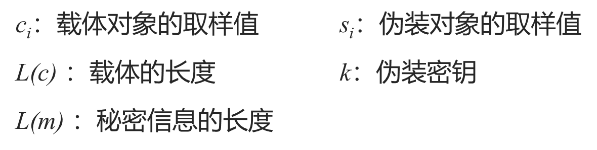
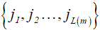
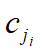
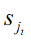

# 4.1 音频隐藏的基本原理

## 音频信号的特点

一维信号 

人耳听觉系统（HAS）比人眼视觉系统（HVS）灵敏得多

## 时间域音频信息隐藏算法

数字化音频中，低有效比特对音质贡献弱。改变低有效比特不会显著影响音质。

# 4.2 LSB音频隐藏算法

## 流载体的LSB方法

### 嵌入

选择一个载体元素的子集，其中共有 *L*(*m*) 个元素，用以隐藏秘密信息的*L*(*m*) 个比特。然后在这个子集上执行替换操作，把的最低比特用*mi*来替换。 

### 提取

找到嵌入信息的伪装元素的子集，从这些伪装对象中抽出它们的最低比特位，排列之后组成秘密信息*m*。 

## LSB算法设计

### 选择隐藏位置子集

#### 顺序选取

发送者从载体的第一个元素开始，顺序选取L(m)个元素作为隐藏的子集。

缺点：已嵌和未嵌部分数据特征不同

#### 随机间隔法

用伪装密钥*k*作为伪随机数发生器的种子，生成一个伪随机序列k1，k2，...，kL(m)，则嵌入位置为

### 选择样点

样点幅值大小与其掩蔽能力有关

静音段——幅值较小的样点不宜用于隐藏

### 选择比特位

低比特位对音质影响小，但容易受到干扰。

# 4.3 回声隐藏算法

在数字声音信号中引入回声，可根据引入回声的位置不同来隐藏秘密信息。

## **原理**

掩蔽效应：强信号的存在会使其附近的弱信号难以被感知。人耳对一个较强声音后的极短时间内的较弱声音的不可察觉性。当回声与原声的间隔充分接近时，人耳难以区别回声和原声。

## 回声隐藏

回声信号，可简单模拟为，原始信号经过时延和幅度衰减后产生的信号。

设原信号为x(t)，时延为δ，衰减为α，则叠加回声的信号为:
$$
y(t)= x(t) + αx(t- δ)
$$
一般情况下，回声时延*δ*的取值一般在50~200ms之间。过小会增加嵌入信息恢复的难度，过大则会影响隐藏信号的不可感知性。同时，回声的幅度系数 α 的取值也同样需要精心选择，其值与信号传输环境和时延取值有关，一般地，α取值在0.6~0. 9之间。

### 1.隐藏算法 

① 首先将音频采样数据文件分成包含N个样点的子帧，子帧的时长可以根据隐藏数据量的大小划分，一般时长从几个毫秒到几十毫秒，每个子帧隐藏一个比特的秘密信息。

② 定义两种不同的回声时延m0、m1 （其中，m0、m1均要求远小于子帧时长N）。当秘密信号比特值为"0"时，回声时延为m0，当秘密信号比特值为"1"时，回声时延为m1。

③ 将载体信号的每个子帧按照式*y[n]=s[n]+α* **s[n-δ]*产生回声信号。

④ 将所有含回声的信号段串联成连续信号。

### 2.提取算法 

① 将接收到的数据按照预定的时长划分为子帧。 

②  求出各段的倒谱自相关值，比较m0和m1处的自相关幅值F0和F1。

​    如果F0大于F1，则嵌入比特值为"0"；

​    如果F1大于F0，则嵌入比特值为"1"。 

# 4.4 MP3音频的编码与解码

## MP3信息隐藏

根据这些算法的嵌入时间的特点对其分为三类：

- 压缩编码前嵌入
- 压缩编码中嵌入
- 压缩编码后嵌入

# 4.5 基于MIDI信息隐藏

MIDI全称是Musical Instrument Digital Interface，即乐器数字接口，也是一种专用于乐器的接口标准。

一个标准MIDI文件基本上是由两部分组成：**头块**和**音轨块**。

- 头块：用来描述整个MIDI文件基本信息。
- 音轨块：包含一系列由MIDI消息构成的MIDI数据流。

## 音轨块的描述

| **标识符串（4字节）**       | **“MTrk”**         |
| --------------------------- | ------------------ |
| 音轨块数据区长度  （4字节） | 单位为字节         |
| 音轨块数据区                | 由多个MIDI事件构成 |

### MIDI事件的构成

MIDI事件=<delta time> <MIDI消息>

<delta time>采用可变长编码，它决定了其后的MIDI消息被执行的时间。 

一个MIDI消息是由一个状态字节及多个数据字节构成。

MIDI消息根据性质可分成:

- #### 通道消息(Channel Message)

  对单一的MIDI Channel起作用，其Channel是利用状态字节的低4位来表示，可从0到15共有16个channel。**通道消息又分为声音消息和模式消息**。

  声音消息用于控制合成器的声音产生。

  模式消息则为最多达16条通道分配声音关系，包括设定单音模式或复音模式等。

- #### 系统消息(System Message) 

  应用于整个系统而不是特定通道，并且不含有任何通道码。

  有三种系统消息：**公共消息、实时消息和专用消息**。

  **公共消息**提供的功能有选择歌曲、用拍子数来设定歌曲位置指针，及向合成器发出旋律请求。

  **实时消息**用来设定系统的实时参数，包括时钟、启动、停止定序器、从停止位置恢复定序器和系统复位。

  **专用消息**包含了厂商特定的数据，如标识、系列号、模型号及其他信息。

## MIDI数字水印算法原理

改变MIDI音乐文件的部分声音消息并不影响MIDI文件的听觉效果，通过实验，改变:

- **声音开启的最低位比特**
- **乐器编号的最低位比特**
- **通道触动压力的低4比特位**

都不会引起听觉差异，因此可在这三种声音消息中嵌入水印信息。