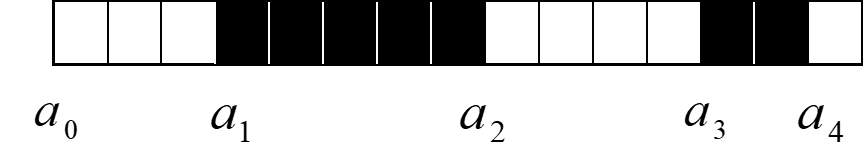

# 5.1 图像的位平面概念

## 图像的数据表示

bit /象素点：256色(0～255)

各像素位置相同的位形成一个平面，称为“**位平面**”。

不同位平面的重要程度不同

-  高位: 图像信息
-  低位: 噪声

 结论：对于256级灰度图像，第一个位平面（连同第二个位平面）对图像能量的贡献较小，可以用于秘密信息的隐藏。

# 5.2 图像的LSB方法

## LSB(Least Significant Bit 最不重要位/最低有效位) 方法

用秘密信息(比特)替换掉最低有效位的数据。

**优点**：简单，易实现，容量大

**缺点**：安全性不高，不能抵抗叠加噪声、有损压缩等破坏

## 提高LSB方法的安全性的措施

1. 对秘密信息先加密后再隐藏

2. 多次重复嵌入

3. 引入纠错编码技术。先进行纠错编码，再进行隐藏。

# 5.3 利用奇偶校验位的方法

把载体划分成几个不相重叠的区域，在一个载体区域中存储一比特信息。

## 嵌入

选择 *L*(*m*)个不相重叠区域，计算出每一区域I的所有最低比特的奇偶校验位(即“1”的个数奇偶性）, *b**i**(**i**=1,2, … ,n)*。

嵌入信息时，在对应区域的奇偶校验位上嵌入信息比特*mi*，如果奇偶校验位*bi*与*mi*不匹配，则将该区域中所有元素的最低比特位进行翻转（或将该区域中的某个像素的最低比特位翻转），使得奇偶校验位与*mi*相同，即*bi*=*mi* 。

## 提取

在接收端，收方与发方拥有共同的伪装密钥作为种子，可以伪随机地构造载体区域。收方从载体区域中计算出奇偶校验位，排列起来就可以重构秘密信息。

# 5.4 基于调色板图像的隐藏法

基于调色板的图像由两部分组成：

**（1）调色板数据**

定义了N种颜色索引对（i，ci）

**（2）图象数据**

保存每一个像素的调色板索引

## 基于调色板图像的LSB方法一

修改调色板颜色向量的LSB

- 对于灰度图像，修改灰度图像的调色板颜色数据对图像的显示没有明显影响。
- 对彩色图像，如果在R.G.B三色中同时修改最低比特位，产生的图像颜色可能会出现偏差，容易引起攻击者的怀疑。

## 基于调色板图像的LSB方法二

修改图像数据（索引）的LSB

可以先将颜色按某种规则排序，使得相邻颜色比较接近，这时索引值所代表的颜色是相近的。例如：将颜色值根据它们在色彩空间中的欧几里得距离进行排序：
$$
d=√(R^2+G^2+B^2 )
$$
这种隐藏信息的方式不具有鲁棒性，任何攻击者都可以通过改变调色板的排序方式（如：“另存为”）来破坏秘密信息，而对图像没有丝毫损害。

## 基于双份调色板索引的隐藏法

保持调色板的颜色不变，将数目扩大一倍，因此图像中的每一个颜色值对应两个调色板索引，根据秘密信息比特，选择两个相同颜色中的一个。接收端利用事先约定的规则，根据每个像素使用的是调色板的哪一个颜色索引来提取出秘密信息。

# 5.5 基于量化编码的信息隐藏

## **原理**

在预测编码中,每一个采样的大小是根据它的邻近采样的值进行预测的。最简单的情况是计算出邻近采样*xi*和*xi-1*的差值，把差值送入量化器，由量化器输出差分信号的一个离散近似值*Δ**i**=Q*(*xi* *- xi-1*)*，*在编码时，只需对*Δi*进行编码即可，这就是所谓的增量编码。在增量编码里面，也可以进行信息的隐藏。

## **嵌入**

计算邻近采样*x**i*和*x**i-1*的差值，对差值进行量化，得到*∆**i**=Q(x**i**-x**i-1**)*，查量化隐藏表。

- 如果*∆**i*与要编码的秘密信息比特相同，则差分信号不变；
- 如果*∆**i*与秘密信息比特不相同，则由最接近的*∆**i*替换，使得查表所对应的比特与秘密信息比特相同。

## 提取

接收者拥有同样的伪装密钥表，它根据伪装对象的相邻数据的差分信号，对应密钥表，可以得到每一个差分值所对应的秘密信息比特。

## 总结

基于量化编码的信息隐藏方法尽管很巧妙，但这种方法同最低比特位隐藏方法一样，仍然属于在噪声信号中隐藏信息，因此其稳健性不强。

# 5.6 二值图像中的信息隐藏

## Zhao—Koch方案

### 嵌入

把一个二值图像分成*L*(*m*)个矩形图像区域*Bi*，如果其中黑色像素的个数大于一半，则表示嵌入0；如果白色像素的个数大于一半，则表示嵌入1。

当需要嵌入的比特与所选区域的黑白像素的比例不一致时，为了达到希望的像素关系，则需要修改一些像素的颜色。修改应遵循一定的规则，原则是不引起感观察觉。修改应在黑白区域的边缘进行 。

### 需注意的细节

选择图像块时，应考虑有一定的冗余度，确定有效区域：

确定两个阈值R1>50％和R0<50％ ，以及一个健壮性参数λ.

隐藏0时，该块的黑色像素的个数应属于[*R*1,*R*1+λ]；

隐藏1时，该块的黑色像素的个数应属于[*R*0−λ] 。

### 标识无效块

 如果为了适应所嵌入的比特，目标块必须修改太多的像素，就把该块设为无效。

方法：将无效块中的像素进行少量的修改，使得其中黑色像素的百分比大于*R1*+3λ，或者小于*R0*-3λ.

### 提取

判断每一个图像块黑色像素的百分比，如果大于*R1*+3λ，或者小于*R0*-3λ，则跳过这样的无效块。

如果在[*R1*,*R1*+λ]或者[*R0*−λ,*R0*]的范围内，则正确提取出秘密信息0或1。

### 简易算法

将原图划分为1×4的矩形像素块，每个区域有四个连续的像素点。这些像素点的取值情况可以分为5类：全白，1个黑像素点，2个黑像素点，3个黑像素点和全黑。

| **黑像素个数** | **0**  | **1**   | **2**    | **3**   | **4**  |
| -------------- | ------ | ------- | -------- | ------- | ------ |
| 像素分布       | 全白   | 1黑3白  | 两黑两白 | 3黑1白  | 全黑   |
| 含义           | 无效块 | 隐藏“1” | 不能出现 | 隐藏“0” | 无效块 |

提取时，遍历携密图像的每个1×4区域，如果黑色像素点个数为1或3则提取信息，1个黑像素点对应‘1’，3个黑像素点对应‘0’，黑色像素为0或4为未嵌入信息的区域。

## 游程编码

编码：< a0 ,3> < a1,5> < a2,4> < a3,2> < a4,1>

### 嵌入

如果秘密信息位是0，则修改该游程长度为偶数；

如果为1，则修改游程长度为奇数；

如果秘密信息的取值与游程长度的奇偶性相匹配，则不改变游程长度。

### 提取

根据游程长度的奇偶性提取出秘密信息。

# 5.7 离散余弦变换（DCT）域的信息隐藏

在载体的显著区域隐藏信息，比LSB方法能够更好地抵抗攻击，而且还保持了对人类感观的不可察觉性。

在DCT域中的信息隐藏，可以有效地抵抗JPEG有损压缩。

## 二维DCT变换

图像分为8×8的像素块，进行二维DCT变换，得到8×8的DCT系数。

最左上角的那个系数为直流系数，其余为交流系数。

左上角的部分为直流和低频，右下角的部分为高频，中间区域为中频。

中低频系数包含了图像的大部分能量，是对人的视觉最重要的部分。

转换 2-D系数区块成 1-D系数：系数按照Zig-Zag次序排列。

## 基本隐藏算法

以一定的方式挑选一些中频系数，在这些中频系数中叠加秘密信息： 

- 所有中频系数
- 固定位置的中频系数
- 随机挑选中频系数
- 选择最大的几个中频系数

# 5.8 小波变换域（DWT）的信息隐藏

一级小波分解后得到的四个部分：

## 基本隐藏算法

同上

# 5.9 文件格式隐藏法

## 原理

在文件格式中找到某些不影响载体文件的位置，嵌入要隐藏的数据。

例如，在位图文件中隐藏数据，可以在文件尾部存放数据，或者在文件头和图像数据之间的位置存放数据。存放时，需要修改文件头中相应的数据，使得修改不影响载体数据的读入和使用。

# 5.10 统计隐藏技术与变形技术

## 统计隐藏技术

对载体的某些统计特性进行明显的修改，表示嵌入信息“1”，若统计特性不变，则表示嵌入信息“0”。

## 变形技术

对载体进行某种修改，其修改方式与需要嵌入的秘密信息比特相关联，通过比较修改后的载体与原始载体的差别来提取隐藏信息。

例如：利用文本的排列或者文档的布局来隐藏信息。可以调节行间距、字间距，以及在文本中加入适当的空格等，代表对信息的编码。