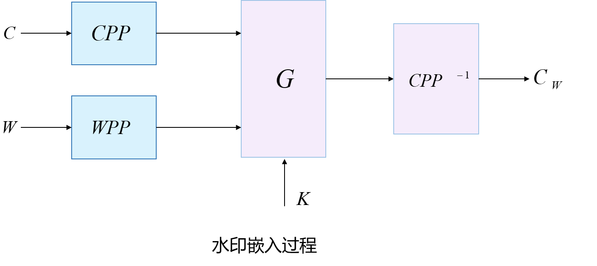

# 7.1 数字水印的形式和产生

|                      | **信息隐藏** | **数字水印** |
| -------------------- | ------------ | ------------ |
| 精确恢复             | 要求严格     | 要求宽松     |
| 抗攻击性  （稳健性） | 需要         | 更严格       |

# 7.2 数字水印框架

# 7.3 数字水印的嵌入

## 嵌入位置的选择

根据Kerckhoffs准则，一个安全的数字水印，其算法应该是公开的，其安全性应该建立在密钥的保密性的基础上，而不应是算法的保密性上。

为了防止水印被偶然地移去，或者被直截了当地提取出水印，可以采用选择水印在载体中嵌入的位置来达到目的。

#### 基于心理视觉考虑

对于图像而言，在纹理较复杂的地方以及物体的边缘区域，人类的视觉系统不太精确，也就是说对这些部分的失真不太敏感，因此在这些地方非常适合嵌入水印。

对于图像取值比较均匀的光滑区域，人眼对这些地方的失真非常敏感，因此这些地方不适合嵌入水印。

## 工作域的选择

#### 空间域水印算法

拼凑算法、LSB方法、选择图像的视觉不敏感区域等。

#### 变换域水印算法

DFT、DCT、DWT域。

## 脆弱性数字水印技术

### 特征

- 检测篡改

  理想情况是能够提供破坏量的多少及修改的位置，甚至能够分析篡改的类型，并能对篡改的内容进行恢复。

- 稳健性与脆弱性

  水印是在满足一定稳健性条件下的脆弱（脆弱与半脆弱）。

- 不可感知性

- 可靠性

### 脆弱性水印的分类

- 完全脆弱性水印：能够检测出任何对图像像素值进行改变的操作或对图像完整性的破坏。
- 半脆弱水印：水印能够允许图像有一定的改变，它是在一定程度上的完整性检验 。
- 图像可视内容鉴别：水印对图像的主要特征进行真伪鉴别，即比前两类水印更加稳健。
- 自嵌入水印：把图像本身作为水印加入，不仅可以鉴别图像的内容，还可以部分恢复被修改的区域。

# 7.4 软件数字水印技术

把程序的版权信息和用户身份信息嵌入到程序中.

## 分类

### 嵌入位置

代码水印：隐藏在程序的指令部分

数据水印：隐藏在数据中（如头文件、字符串和调试信息等）

### 被加载的时刻

静态水印：存储在可执行程序代码中（静态代码水印，静态数据水印）

动态水印：保存在程序的执行状态中（Easter Egg水印、数据结构水印、执行状态水印）

动态水印需要有预先输入，根据输入，程序会运行到某种状态，这些状态就代表水印。

# 7.5 音频数字水印技术

见第四章

# 7.6 视频数字水印技术

## 分类

### 按水印技术是否与内容相关分类

- 第一代视频水印：与视频内容无关

  （MPEG1和MPEG2：帧内图I、预测图P、双向预测图B）

- 第二代视频水印：基于内容的视频水印

  （MPEG4标准首次以视频对象（Video Object）概念来实现基于内容的表示，视频对象主要被定义为画面分割出来的不同物体，通过运动信息、形状信息、纹理信息来描述 ）

### 按照水印嵌入的策略分类 

- 在未压缩域中

  移植静止图像的水印技术，结合视频帧结构特点，形成适用于视频的水印方案。

- 在视频编码器中

  通过修改变换域系数，能得到较好的视频质量和较强的水印抗攻击能力，同时不会增加数据比特率。

- 在视频码流中

  最大优点就是不需要完全解码和再编码，提高了水印嵌入和提取的效率，但是能够嵌入的水印容量受到较大的限制，而且水印的嵌入有可能对视觉产生影响 。

### 按照压缩编码标准分类 

- **基于MPEG1或MPEG2标准**：如在未压缩域对视频帧进行水印嵌入，或者在视频压缩编码中进行嵌入修改，也有直接将水印信息嵌入到压缩码流中 **。**
- **基于MPEG4标准**：先提取视频对象，然后选择视频对象的部分属性作变换，嵌入水印。
- **基于其它压缩标准的视频水印。** 