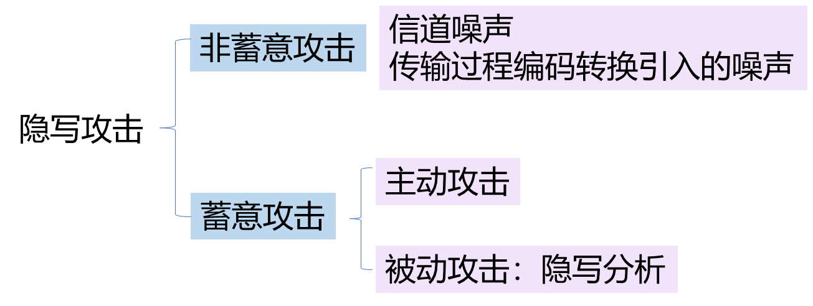
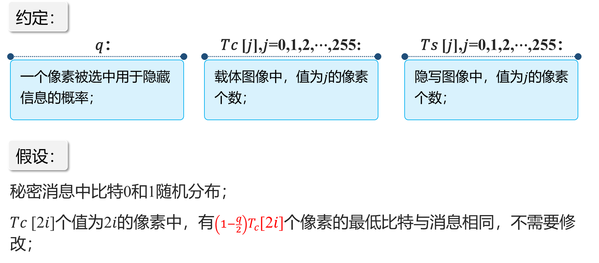
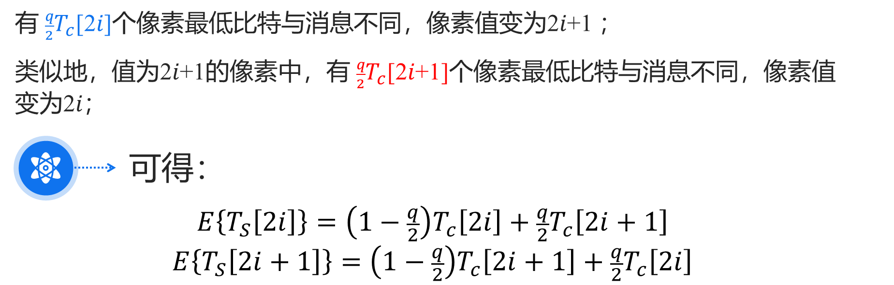
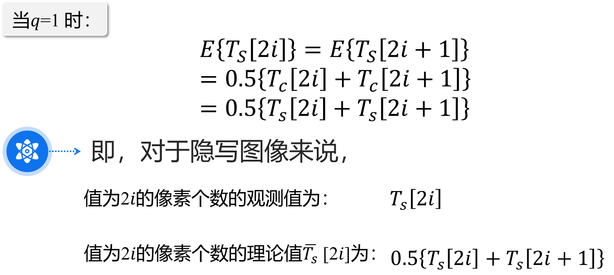

# 8.1 隐写分析分类

## 根据适用性分类

- 专用隐写分析

  针对特定隐写技术或研究对象的特点进行设计。

- 通用隐写分析

  不针对某一种隐写工具或隐写算法的盲分析。

## 根据已知消息分类

- #### 唯隐文攻击（Stego-only attack）

  只有隐写对象可用于分析。

- #### 已知载体攻击（Known-cover attack）

  可利用原始的载体对象和隐写对象 。

- #### 已知消息攻击（Known-message attack）

  已知隐藏的消息。

- #### 选择隐文攻击（Chosen-stego attack）

  知道隐藏算法和隐秘对象

- #### 选择消息攻击（Chosen-message attack）

  用某个隐藏算法对一个选择的消息产生伪装对象，然后分析伪装对象中产生的模式特征

- #### 已知隐文攻击（Known-stego attack）

  知道隐藏算法，可利用原始对象和隐写对象。

## 根据采用的分析方法分类

- 感官分析

  用人眼、耳对伪装对象进行分析，判断是否可疑。

- 统计分析

  对比正常载体的和伪装对象的理论期望频率分布。

- 特征分析

  寻找特定隐藏算法所产生的固有特征。

## 根据最终的效果分类

- 被动隐写分析

  仅仅是判断多媒体数据中是否存在秘密信息。

  尝试判断携密载体所采用的算法。

- 主动隐写分析：

  估算隐藏信息的长度。

  估计隐藏信息的位置。

  猜测隐藏算法使用的密钥。

  猜测隐藏算法所使用的某些参数。

  提取隐藏的秘密信息----终极目标。

# 8.2 信息隐藏分析的层次

- #### 发现隐藏信息

- #### 提取隐藏信息

- #### 破坏隐藏信息

# 8.3 隐写分析评价指标

准确性、适用性、实用性、复杂度

当某一个算法的**准确性**较高时候，这种算法或许只能是针对某一种或者某几种隐写算法，**适用性**较差。当某一种算法适用性较好时，这种算法的准确性可能就较差。

当采用高阶或者更多统计特征进行分析的隐写分析算法时，**复杂度**会提高，同时将会更加有效地检测出秘密信息，增加算法的准确性，但是算法的**实用性**就比较差。

# 8.4 LSB隐藏的卡方分析

## 原理：图像隐写后，灰度值为2i和2i+1的像素出现频率趋于相等。

# 9.1 数字水印攻击 

### 去除攻击

试图削弱载体中的水印强度，或破坏载体中的水印存在

### 表达攻击

试图使水印检测失效

### 解释攻击

通过伪造水印来达到目的

### 法律攻击

利用法律上的漏洞

## 水印攻击软件

**Unzign**

StirMark

Checkmar

Optimark