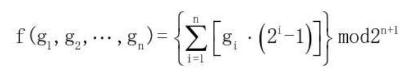
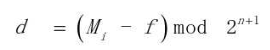
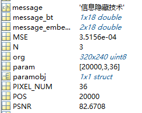
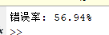
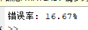

# 实验十 研读文献并复现其中的算法

## 实验要求
> 在网上（例如CNKI）搜一篇信息隐藏或数字水印的学术论文，复现其中的算法，有能力的同学可以对其方法进行改进、实现。 
>
> 要求： 
>
>  1、写出实验报告，含程序代码和截图，word或pdf格式。 
>
>  2、准备PPT； 
>
>  3、课堂展示。 

## 参考文献

[基于GEMD的图像隐写算法效率研究](https://kns.cnki.net/kcms/detail/detail.aspx?dbcode=CMFD&dbname=CMFD202101&filename=1020306468.nh&uniplatform=NZKPT&v=yiRe1exwlgASAvQhT6RXK8I4_qVDO7eSjyPqEKZHEPPyUzq8eqJ7nQxpVdy6fXW_)

## 一、GEMD图像隐写算法

GEMD图像隐写算法即广义的EMD图像隐写算法,它是LWC方法的通用版本,算法核心思想是通过调整n个载体像素来嵌入n+1位的秘密数据。这n个载体像素每一个都可以进行加或者减或者不变3种操作。GEMD图像隐写算法的函数如下公式所示: 



### 1. GEMD图像隐写算法的隐写流程 

#### 第一步

将载体图像进行分组,使每组包含n个可以调整的载体像素(g1,g2,...,gn),然后根据式(3-13)分别计算函数值f; 

#### 第二步

从秘密数据M中截取(n+1)位的秘密数据,并将其转换成十进制格式; 

#### 第三步

根据下式计算差值d:



#### 第四步

若 d=0,则 x=1;若 d=2^n,则 x=2;若 0<d<2^n，则 x=3,;若 d>=2^n，则 x=4;

#### 第五步

根据第四步中x的值分别进行操作:

若x=1,则g′=g,∀i∈1,2,,n;

若x=2,则′g′=g,∀i∈2,3,,n-1

若x=3,将d转换成(bn bn-1 ... b1 b0)2的形式,

​	若(bi=0&bi-1=0)或者(bi=1&bi-1=1),则gi′=gi ;

​	若(bi=0&bi-1=1),则gi′=gi+1; 

​	若(bi=1&bi-1=0),则gi'=gi-1;

若x=4,d=2-d,将d'转换成(bn bn-1 ... b1 b0)2形式,当i从n到1时:

​	若(bi=0&bi-1=0)或者(bi=1&bi-1=1),则gi′=gi ;

​	若(bi=0&bi-1=1),则gi′=gi-1; 

​	若(bi=1&bi-1=0),则gi'=gi+1;

#### 第六步

重复步骤,直到完成所有秘密信息的嵌入。

### 2. GEMD图像隐写算法的解析过程

#### 第一步

将隐写图像像素进行分组,将n个载体像素作为一个调整组进行计算,根据下式计算出函数值f; 


#### 第二步

秘密信息M=f,将M转换成二进制字符串即可获得相应的秘密数据。 

### 3. GEMD算法示例

#### 隐写加密示例

例如,想将秘密信息M=(1101)2 = 13嵌入到三个载体像素(g1,g2,g3)=(148,171,165)中,根据GEMD图像隐写算法,可以得到隐写后的像素值(g1’,g2’,g3’)=(149,170,166)。

具体流程如下: 

第一步:根据上式计算f(g1,g2,g3)=(148×1+171×3+165×7)mod16=8; 

第二步:根据上式计算d=(13-8)mod16=5; 

第三步:根据GEMD图像隐写算法,因为d=5<23=8,所以x=3; 

第四步:当x=3时,d=3=(0101)2:

​	当i=3时,因为b3=0&b2=1,所以g3’=g3+1 =166;

​	当i=2时,因为b2=1&b1=0,所以g2’=g2-1=170;

​	当i=1时,因为b1=0&b0=1,所以g1’=g1+1=149; 

所以隐写图像中三个像素的像素值就变成了(g1’,g2’,g3’)=(149,170,166)。 

#### 信息提取示例

当接收者收到后对这三个像素进行还原,就得到了秘密信息M=(1101)2 = 13。

具体流程如下: 

第一步:计算f(149,170,166)=(149×1+170×3+166×7)mod16=13; 

第二步:M=f=13=(1101)2,得出秘密信息。 

可以发现,当n=3时,LWC是GEMD方案的一种特殊情况。LWC可以实现1.5bpp的嵌入容量,但是它的像素值的数量是固定的,只能利用两个像素的修改实现图像隐写。而新提出的GEMD图像隐写算法更为灵活,可以根据需要确定隐写像素数量。根据理论计算可以发现,GEMD图像隐写算法的隐写率为(n+1)/n,可以始终保持超过1bpp的隐写容量。

## 二、实现方法

1. 将载体图像进行分组，使每组包含 n 个可以调整的载体像素（g1，g2,...,gn）,分别计算函数值 f； 
2. 从秘密数据 M 中截取（n+1）位的秘密数据，并将其转换成十进制格式； 
3. 计算差值 d： 

4. 若 d=0，则 x=1；若 d=2^n，则 x=2；若 0＜d＜2n，则 x=3,；若 d≥2^n，则 x=4；
5. 由x的取值决定对像素组的操作，基本上是灰度的加一减一


## 三、文件说明
```
│  d2x.m  d转换为x(d,x含义具体见文献)
│  imgAttack.m 检测伪装图像健壮性
│  pixelChange.m 转换像素组
│  Steganography.m 隐写及解隐文件(主)
│  
└─IMG
        lenna.bmp   载体图像
        lenna_h.bmp     伪装图像
```

## 四、代码分析

### d2x.m

`d2x`函数用于实现d向x的转换，根据算法描述的四种情况分别处理。

```matlab
function x = d2x(d,N)
    if d == 0
       x = 1; 
    elseif d == 2^N
        x = 2;
    elseif d > 0 && d < 2^N
        x = 3;
    elseif d >= 2^N
        x = 4;
    end
end
```

### pixelChange.m

 `pixelChange` 函数根据参数 `x` 和 `d` 对像素组 `px` 进行修改。

函数 `pixelChange` 有四个输入参数：

- `px`：像素组
- `x`：用来确定像素组需要进行的修改类型
- `N`：像素组的大小
- `d`：需要嵌入的信息差值

#### 情况 1：`x == 1`

```matlab
if x == 1
        px_changed = px; % 如果 x 为 1，不做任何修改
```

当 `x` 为 1 时，不对像素组 `px` 进行任何修改，`px_changed` 直接等于 `px`。

#### 情况 2：`x == 2`

```matlab
elseif x == 2
        px_changed = px;
        px_changed(1) = px_changed(1) + 1; % 增加第一个像素值
        px_changed(N) = px_changed(N) + 1; % 增加最后一个像素值
```

当 `x` 为 2 时，将像素组 `px` 的第一个和最后一个像素值各加 1。

#### 情况 3：`x == 3`

```matlab
elseif x == 3
        d_bin = dec2bin(d, N+1); % 将 d 转换为 N+1 位的二进制字符串
        d_bin = d_bin(end:-1:1); % 字符串反转
        for i = 2:N+1
           if d_bin(i) == '0' && d_bin(i-1) == '0' || ...
               d_bin(i) == '1' && d_bin(i-1) == '1'
               px_changed(i-1) = px(i-1); % 如果相邻两位相同，不做修改
           elseif d_bin(i) == '0' && d_bin(i-1) == '1'
               px_changed(i-1) = px(i-1) + 1; % 如果前一位是1，当前位是0，像素值加1
           elseif d_bin(i) == '1' && d_bin(i-1) == '0'
               px_changed(i-1) = px(i-1) - 1; % 如果前一位是0，当前位是1，像素值减1
           end
        end
```

当 `x` 为 3 时，首先将 `d` 转换为 N+1 位的二进制字符串，并反转字符串。然后根据相邻位的关系对像素值进行修改：

- 相邻位相同时，不修改像素值。
- 前一位为1且当前位为0时，将像素值加1。
- 前一位为0且当前位为1时，将像素值减1。

#### 情况 4：`x == 4`

```matlab
elseif x == 4
        d_t = 2^(N+1) - d; % 计算补码
        d_bin = dec2bin(d_t, N+1); % 将补码转换为二进制字符串
        d_bin = d_bin(end:-1:1); % 字符串反转
        for i = 2:N+1
           if d_bin(i) == '0' && d_bin(i-1) == '0' || ...
               d_bin(i) == '1' && d_bin(i-1) == '1'
               px_changed(i-1) = px(i-1); % 如果相邻两位相同，不做修改
           elseif d_bin(i) == '0' && d_bin(i-1) == '1'
               px_changed(i-1) = px(i-1) - 1; % 如果前一位是1，当前位是0，像素值减1
           elseif d_bin(i) == '1' && d_bin(i-1) == '0'
               px_changed(i-1) = px(i-1) + 1; % 如果前一位是0，当前位是1，像素值加1
           end
        end
    end
end
```

当 `x` 为 4 时，首先计算 `d` 的补码 `d_t`，将其转换为二进制字符串并反转。然后根据相邻位的关系对像素值进行修改，逻辑与情况 3 类似，但操作相反（加减相反）。

### Steganography.m

#### 信息嵌入

```matlab
clc, clear;

POS = 20000; % 嵌入的起始位置
N = 3; % GEMD N参数，N最好为奇数

message = '信息隐藏技术'; % 要嵌入的消息
message_byte = unicode2native(message, 'UTF-8'); % 转换为字节
[~, n] = size(message_byte);
message_int_4bit = zeros(2, n);
for i = 1:n
    cur_uint = message_byte(i);
    message_int_4bit(1,i) = bitand(cur_uint, 0x0f); % 低四位
    message_int_4bit(2,i) = bitshift(cur_uint, -4); % 高四位
end
message_embed_form = reshape(message_int_4bit, [], 1); % 要嵌入的信息

PIXEL_NUM = length(message_embed_form); % 要嵌入的像素组数
param = [POS, N, PIXEL_NUM];
save('param.mat', 'param'); % 保存参数
```

这段代码将要嵌入的信息转换为字节，并将每个字节分成高四位和低四位，存储在 `message_embed_form` 中。保存嵌入参数到 `param.mat` 文件。

#### 嵌入信息到图像

```matlab
F = zeros(size(message_embed_form)); % 存储F函数的值
imdata = imread('./IMG/lenna.bmp'); % 读取图像
[row, col] = size(imdata);
imdata = reshape(imdata,[],1);
POS_END = POS + length(message_embed_form);

for j = 1:PIXEL_NUM
    pt = POS + (j-1)*N; % 像素位置
    f_tmp = 0;
    for i = 1:N
        shifted_pos = i - (N+1)/2;
        tmp = (2^i-1)*double(imdata(pt + shifted_pos)); % 转换为double
        f_tmp = f_tmp + tmp;
    end
    f_tmp = mod(f_tmp, 2^(N+1));
    F(j) = f_tmp;
    d = double(message_embed_form(j)) - f_tmp;
    d = mod(d, 2^(N+1));
    x = d2x(d, N);

    ind = 1:N;
    ind = ind - (N+1)/2 + pt;
    pixel_group = double(imdata(ind));
    px_changed = pixelChange(pixel_group, x, N, d); % 更改像素值
    imdata(ind) = uint8(px_changed); % 更新像素值
end

imdata = reshape(imdata, row, col);
imwrite(imdata, './IMG/lenna_h.bmp'); % 保存嵌入信息后的图像
```

这段代码将信息嵌入到图像中，通过修改图像的像素值来嵌入信息。最终保存嵌入信息后的图像。

#### 信息提取

```matlab
clc, clear;
imdata_h = imread('./IMG/lenna_h.bmp'); % 读取嵌入信息后的图像
[row, col] = size(imdata_h);
imdata_h = reshape(imdata_h,[],1);

paramobj = load('./param.mat'); % 读取嵌入参数
param = paramobj.param;
POS = param(1);
N = param(2);
PIXEL_NUM = param(3);

message_embeded_extracted = zeros(PIXEL_NUM, 1); % 存储提取的信息
for i = 1:PIXEL_NUM
    pt = POS + (i-1)*N;
    f_tmp = 0;
    for j = 1:N
        shifted_pos = j - (N+1)/2;
        tmp = (2^j-1)*double(imdata_h(pt + shifted_pos)); % 转换为double
        f_tmp = f_tmp + tmp;
    end
    f_tmp = mod(f_tmp, 2^(N+1));
    message_embeded_extracted(i) = f_tmp;
end

message_embeded_extracted = reshape(message_embeded_extracted, 2, []);
[~, M] = size(message_embeded_extracted);
message_bt = zeros(1, M);
for i = 1:M
    l4bit = message_embeded_extracted(1, i);
    h4bit = message_embeded_extracted(2, i);
    cur_uint8 = bitshift(h4bit, 4) + l4bit;
    cur_uint8 = uint8(cur_uint8);
    message_bt(i) = cur_uint8;
end
message = native2unicode(message_bt, 'UTF-8'); % 转换为原始信息
```

这段代码从图像中提取嵌入的信息，恢复为原始信息。

#### 性能评估

```matlab
org = imread('./IMG/lenna.bmp'); % 读取原始图像
ch = imread('./IMG/lenna_h.bmp'); % 读取嵌入信息后的图像
MSE = (org - ch).^2;
MSE = sum(sum(MSE,1))/(row*col); % 计算MSE
PSNR = 10*log10(255^2/MSE); % 计算PSNR
```

这段代码计算原始图像和嵌入信息后的图像之间的均方误差（MSE）和峰值信噪比（PSNR），用于评估嵌入信息对图像质量的影响。

## 五、实验结果


上图分别是原图与嵌入信息后的图像，肉眼观察无差别。



结果显示正确提取到了隐藏信息，计算两图像间的MSE=3.5156e-4，PSNR=82.6708，可以说明两幅图像相似度非常高。

## 六、攻击抵抗能力评估

#### 1. 高斯滤波
通过卷积核为5x5，标准差为1的高斯滤波器，对图像进行平滑处理。

```matlab
clc, clear;
imdata_h = imread('./IMG/lenna_h.bmp');  % 读取嵌入信息后的图像
sigma = 1;  % 设置高斯滤波的标准差
gausFilter = fspecial('gaussian', [5,5], sigma);  % 创建高斯滤波器
imdata_ft = imfilter(imdata_h, gausFilter, 'replicate');  % 对图像进行高斯滤波
[row, col] = size(imdata_ft);  % 获取滤波后图像的大小
imwrite(imdata_ft, './lenna_gaus.bmp');  % 保存滤波后的图像
```

#### 2. JPEG压缩攻击
接着将图像以质量100保存为JPEG格式，进行有损压缩，同样处理嵌入信息后的图像 `lenna_h.bmp`。

```matlab
clc, clear;
imdata_h = imread('./IMG/lenna_h.bmp');  % 读取嵌入信息后的图像
imwrite(imdata_h, 'lenna_jpg.jpg', 'Quality', 100);  % 以质量100保存为JPEG格式
imdata_ft = imread('./lenna_jpg.jpg');  % 读取JPEG压缩后的图像
[row, col] = size(imdata_ft);  % 获取压缩后图像的大小
```

#### 3. 信息提取
- 读取嵌入参数 `param.mat`，获取起始位置 `POS`，参数 `N`，以及嵌入的像素数 `PIXEL_NUM`。
- 从滤波或压缩后的图像中，按照嵌入时的方式，计算出嵌入信息并存储在 `message_embeded_extracted` 中。

```matlab
paramobj = load('./param.mat');  % 读取嵌入参数
param = paramobj.param;
POS = param(1);
N = param(2);
PIXEL_NUM = param(3);

message_embeded_extracted = zeros(PIXEL_NUM, 1);  % 存储提取的信息
for i = 1:PIXEL_NUM
    pt = POS + (i-1)*N;
    f_tmp = 0;
    for j = 1:N
        shifted_pos = j - (N+1)/2;
        tmp = (2^j-1)*double(imdata_ft(pt + shifted_pos));  % 转换为double
        f_tmp = f_tmp + tmp;
    end
    f_tmp = mod(f_tmp, 2^(N+1));
    message_embeded_extracted(i) = f_tmp;
end
```

#### 4. 错误率计算
- 读取原始嵌入信息 `message_embed_orgin.mat`，将其转换为4位二进制。
- 将提取出的信息同样转换为4位二进制，逐位比较，统计不同位数的数量 `count`，即错误率。

```matlab
m_org = load('./message_embed_orgin.mat');
m_org = m_org.message_embed_form;
count = 0;
total_bits = 0;

for i = 1:length(m_org)
    org = dec2bin(m_org(i), 4);
    extracted = dec2bin(message_embeded_extracted(i), 4);
    for j = 1:4
        total_bits = total_bits + 1;
        if org(j) ~= extracted(j)
            count = count + 1;
        end
    end
end

error_rate = count / total_bits;
fprintf('错误率: %.2f%%\n', error_rate * 100);
```

#### 5. 结果评估

高斯滤波攻击效果：



JPEG压缩攻击效果：



可以看到GEMD隐写算法对高斯滤波攻击的抵抗效果较差，但对JPEG压缩攻击的抵抗效果较好。
