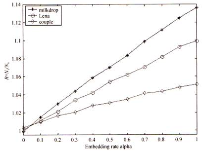

卡方分析的原理是**图像隐写后，灰度值为2i和2i+1的像素出现频率趋于相等**。

信息隐藏的主要分支包括:隐写术、数字水印、隐蔽信道和信息分存等。

在国际上正式提出信息隐形性研究是在1992年。国际上第一届信息隐藏研讨会学术会议于1996年在剑桥大学举行。

判断载体中是否有秘密消息隐藏其中，可能会出现以下四种情况，其中实际无隐藏，判断有隐藏属于纳伪错误。

动态软件水印的验证和提取必须依赖于软件的具体运行状态，与软件文件的内容或存储不相关。

半脆弱水印技术主要用于内容篡改检测，因为对半脆弱水印图像进行普通信号处理。例如，JPEG压缩、去噪等，不会影响水印的提取，但对图像内容的篡改将导致水印信息丢失。

与原始图像相比，采用F5算法隐写的图像，其DCT量化系数直方图更"瘦"、更"高" 。

模块并行化是保持软件语义的软件水印篡改攻击方法之一。

二维离散小波变换处理图像，一级分解后的图像变为近似部分 、水平方向细节部分、垂直方向细节部分、对角线方向细节部分。

任何水印算法都需要在透明度、容量和鲁棒性三种性能参数之间完成平衡。

古代的隐蔽信息的方法可以分为两种基本方式：一种是将机密信息进行各种变化，使它们无法被非授权者所理解，另一种是以隐蔽机密信息的存在为目的。它们的发展可以看成两条线，从古典密码术，发展到现代密码学；从古典隐写术，发展到现在的伪装式信息安全、信息隐藏和数字水印。

 水印嵌入位置的选择应该考虑两方面的问题：一个是安全性问题，一个是对载体质量的影响问题。     

# 简答题

### 1.信息隐藏最重要一种特征不可感知性(透明性)表示的大致含义是什么? 

答:不可感知性包含两个方面的含义。

第一是指隐藏的秘密信息不对载体在视觉或者听觉上产生影响。隐藏的信息附加在某种数字载体上，必须保证它的存在不妨碍和破坏数字载体的欣赏价值和使用价值，即不能因在一幅图像中加入秘密信息而导致图像面目全非，也不能因在音频中加入秘密信息导致声音失真。

第二是要求采用统计方法不能恢复隐藏的信息，如对大量的用同样方法隐藏信息的信息产品采用统计方法也无法提取隐藏的秘密信息。

### 2.简述什么是回声隐藏算法。 

答:回声信息隐藏是利用人类听觉系统的一个特性:音频信号在时域的向后屏蔽作用， 即弱信号在强信号消失之后变得无法听见。弱信号可以在强信号消失之后50~200 ms的作用而不被人耳觉察。音频信号和经过回声隐藏的秘密信息对于人耳朵来说，前者就像是从耳机中听到的声音，没有回声。而后者就像是从扬声器中听到的声音。

### 3.简述什么是音频文件的相位信息隐藏算法。

答：相位编码是利用人类听觉系统对声音的绝对相位不敏感，但对相对相位敏感的特殊进行数字水印嵌入的。在相位编码中，载体信号首先分成若干个短序列，然后进行DFT变换，修改所有信号片段的绝对相位，同时保存它们的相对相位差不变，然后通过IDFT得到伪装信号;在恢复秘密信息之前，必须采用同步技术，找到信号的分段。已知序列长度，接收者就能计算DFT，并能检测出相位*Φ0k* ;该算法对载体信号的再取样有鲁棒性，但对大多数音频压缩算法敏感。由于仅在第一个信号片段进行编码，数据传输率很低。 

### 4.简述无密钥信息隐藏系统。 

答:如果一个信息隐藏系统不需要预先预定密钥，称为元密钥信息隐藏系统。在数学上，信息隐藏过程可以称为一个映射E:CXM→C'，这里C表示所有可能载体的集合，M表示所有可能秘密消息的集合，C'表示所有伪装对象的集合。信息提取也是一个映射过程， D:C'→M。发送方和接收方事先约定嵌入算法和提取算法，但这些算法都是要求保密的。 

### 5.简述半脆弱和脆弱水印的主要区别。 

答:脆弱水印对各种图像信号处理操作都敏感，载体数据发生改变时，水印信息就丢失了。有的场合要求只要图像内容没有发生变化，就应该依然能够检测水印。例如，使用JPEG压缩图像后，图像内容没有发生变化，此时应该能够检测水印，因此产生了半脆弱水印算法。这种算法能够抵抗普通信号处理操作，如去噪、压缩等，但对内容篡改操作敏感。

### 6.简述密码学和信息隐藏的主要区别。 

答:密码学的主要思路是使秘密信息"不可懂"，秘密信息加密后变成乱码，容易引起攻击者怀疑。密码学方法产生的签名及秘密信息分别存储在不同的数据结构中，物理上可以剥离，攻击者甚至不需要改写信息，只要删除签名，就能使接受者无法使用没有篡改的秘密信息。密码学方法加密的秘密信息，哪怕错1 bit，其他信息都无法恢复。 

信息隐藏的主要思路是使秘密信息"不可见"，携带秘密信息的隐蔽载体与普通载体相似，不引起攻击者怀疑。秘密信息是掩蔽载体的一部分，在保证掩蔽载体使用价值的情况下，难以去除秘密信息，部分区域的秘密信息不能正确提取不会影响其他区域的信息提取。

### 7.简述保持软件语义的篡改攻击。 

答:保持软件语义的篡改攻击主要分为两大类：控制流程变换和数据变换。

控制流程变换又包括:插入支路、增加冗余操作数、模块并行化、简单流程图复杂化、环语句变换和内嵌技术。

数据变换又包括:数据编码、改变变量的存储方式和生存周期、拆分变量。

### 8.简述水印攻击算法中的马赛克攻击。 

答:马赛克攻击的方法是将图像分解成为许多个小图像，每一块小到不能进行可靠的水印检测，拼接后的图像与原始图像在感知上相同。马赛克攻击的目标是使得水印检测器检测不到水印的存在，因为马赛克攻击不改变图像的质量，但是水印的检测失效了。

### 9.简单描述一种在BMP图像格式位图文件的两个有效数据结构之间隐藏信息的方法。

答:每种格式化的文件都有自己的文件结构，比如BMP图像就是由文件头、信息头、调色板区和数据区四个部分组成;BMP图像可在BMP调色板和实际数据区之间隐藏秘密信息。 

### 10.结构微调法是对文本的空间特征进行轻微调整来嵌入秘密信息的方法，一般采用的方法是行移位编码、字移位编码和特征编码三种方法，简述以上三种方法。

答:行移位编码就是在文本的每一页中，每间隔一行轮流地嵌入水印信息。但嵌入信息的行的相邻上下两行的位置不动，作为参考，需嵌入信息的行根据水印数据的比特流进行轻微的上移和下移。在移动过的一行中编码一个比特信息，如果这一行上移，则编码为1，如果这一行下移，则编码为0。 

字移位编码是通过将文本某一行中的一个单词进行水平移位。通常在编码过程中，将某一个单词左移或者右移，而与其相邻的单词并不移动，这些不动的单词作为解码过程中的参考位置。

特征编码是通过改变文档中某个字母的某一特殊特征来嵌入标记。在这种编码中，水印信息作为可见的噪声叠加到字母笔画的边缘和文本中图像的边界上，对噪声图像进行二值编码，从而达到嵌入水印的目的。比较典型的方法是设计两种字体。

11. ### 下图是GPC分析方法数据图，横轴表示嵌入率，纵轴表示特定嵌入率下计算所得的N1与N0的比值，不同曲线是对光滑程度不同的图像作分析得到的结果(星形点折线由最光滑的图像分析而得，菱形点折线由纹理最复杂的图像分析而得)。分析从图像中可以得到两个结论。

答:第一，随着嵌入率的增加，N1与N0的比值越来越大，因此越容易准确判断图像是否经过LSB类算法处理。第二，相同嵌入率情况下，图像越光滑，N1与N0的比值越大，这是因为原始图像基数较小，所以比值对算法处理敏感，相对应地，嵌入秘密信息时，应尽可能选择纹理丰富的载体，以增加安全性。

### 12.在隐写分析中，要在原始载体、嵌入信息后的载体和可能的秘密信息之间进行比较。和密码学相类似，隐写分析学也有一些相应攻击类型根据已知消息的情况，参考密码分析的分类方法，对信息隐藏检测的分类，可以分为几类?简单描述这几种类型。 

答: 

(1)仅知掩蔽载体攻击:分析者仅持有可能有隐藏信息的媒体对象，对可能使用的隐写算法和隐写内容等均全然不知，是完全的盲分析。

(2)己知载体攻击:将不含密的已知原始媒体与分析对象比较，检测其中是否存在差异。

(3)已知隐藏消息:分析者知道隐蔽的信息或者它的某种派生形式。 

(4)可选隐藏对象:在已知对方所用隐写工具和掩蔽载体的基础上提取信息。 

(5)可选消息:分析者可使用某种隐写工具嵌入选择的消息产生含密对象，以确定其中可能涉及某一隐写工具或算法的相应模式。

(6)已知隐藏算法、载体和伪装对象。

### 13.简述嵌入效率和载体数据利用率的含义，嵌入效率高意味着什么? (从透明度和容量两方面分析。) 

答:嵌入效率(嵌入比特数/平均修改长度)指平均每修改1个样点可以嵌入多少比特秘密信息，载体数据利用率(秘密信息总数/样点总数)指平均每个样点可以隐藏多少比特秘密信息。嵌入效率高意味着同样嵌入量，对图像的修改少，失真小。但与此同时，载体数据利用率下降，隐藏相同的秘密信息需要更多的像素。

### 14.简述信息隐藏算法的三个主要性能评价指标及其含义。 

答:信息隐藏算法的主要性能评价指标是指:透明性、容量、鲁棒性、安全性和可检测性。其中:

透明性描述算法对载体感官质量造成的影响，算法应该不显著影响载体感官质量。

容量指在载体中能够嵌入的秘密信息总量，通常将之除以样本总数得到平均每样本嵌入量。

鲁棒性指算法抵抗普通信号处理操作的能力。 

15. ### 简述卡方分析、RS分析和GPC分析的原理。

答:

(1)卡方分析原理:LSB隐写会使值对出现次数趋于相等，据此采用大数定理可以构造服从卡方分布统计量，计算待检测图像的该统计量可以判定图像是否经过LSB隐写。 

(2) RS分析原理:对自然图像，非负和非正翻转同等程度地增加图像的混乱程度。而对隐写图像，采用非负翻转后，规则图像块比例和不规则图像块比例的差值随隐写率的增大而减小，采用非正翻转却不会出现上述情况。

(3) GPC分析原理:GPC分析也利用图像空间相关性进行隐写分析。对于自然图像，N0（图像的三维曲面穿越平面簇z=1.5,3.5，...，255.5的次数）近似等于N1（图像的三维曲面穿越平面簇z=0.5,2.5，...，254.5的次数）;而对于隐写图像，N1与N0的比值随隐写率增大而增加。

### 16.根据攻击者掌握信息的不同，隐写分析可分为哪五类，请简单介绍。 

答: 

(1)仅知掩蔽载体攻击:分析者仅持有可能有隐藏信息的媒体对象，对可能使用的隐写

算法和隐写内容等均全然不知，是完全的盲分析。 

(2)已知载体攻击:将不含密的已知原始媒体与分析对象比较，检测其中是否存在差异。

(3)已知隐藏消息:分析者知道隐蔽的信息或者它的某种派生形式。 

(4)可选隐藏对象:在已知对方所用隐写工具和掩蔽载体的基础上提取信息。 

(5)可选消息:分析者可使用某种隐写工具嵌入选择的消息产生含密对象，以确定其中可能涉及某一隐写工具或算法的相应模式。

### 17.根据嵌入码流类型的不同可将视频水印方案分为三类，请简要介绍这三种类型的水印方案。 

答:

根据嵌入码流类型的不同可将视频水印方案分为三类，分别是基于原始视频的水印方案、基于视频编码的水印方案和基于压缩视频的水印方案。

基于原始视频的水印方案是将水印信息直接嵌入到原始的图像码流中，形成含有水印的原始视频信息，然后进行视频编码。这种方案可以充分利用静止图像的水印技术，结合视频帧的结构特点，形成适用于视频水印的方案。

基于视频编码的水印方案是在编码时嵌入水印。当前视频的基本编码思想是运动补偿预测和基于块的编码。在编码压缩时嵌入水印，可以直接与视频编码器相结合。 水印的嵌入和提取过程是在视频编解码器中进行。

基于压缩域的水印信息是将水印信息直接嵌入到编码压缩后的比特流中，这种方案适用于不能直接介入视频编码过程、只能得到编码视频流的场合。

### 18.隐写术与数字水印的区别。 

答:

隐写术与数字水印存在密切联系，特别是不可见水印和隐写术更难彼此区分。但是，隐写术和数字水印确实各有特点。首先是它们的目标不同，隐写术的主要目标是使得对手不能确认信息隐藏是否存在，而水印的主要目标是保护数字产品的知识产权。其次是评价标准不同，隐写术最重要的评价标准是透明性，数字水印最重要的评价标准是鲁棒性。

### 19.隐写分析的目标是什么? 

答:隐写分析技术是对表面正常的图像、音频等载体进行检测，以判断载体中是否隐藏有秘密信息，甚至只是指出媒体中存在秘密信息的可能性。另外，隐写分析还可以对看似可疑的载体实施主动攻击，即删除或者破坏嵌入的秘密信息以达到阻止隐蔽通信的目的。

### 20.简述什么是针对水印鲁棒性的几何攻击。 

答:水印信息的几何攻击包括:时间上和空间上的延迟（平移）、缩放和剪切。图像水印还包括:仿射变换。载体遭受几何攻击后，会失去水印的同步。

### 21.信息隐藏评价的指标有三个，分别是不可感知性、鲁棒性和容量，但是这三个性能指标之间相互制约，请简单介绍这三种性能指标，并简要描述这三种性能指标之间的关系。

答:信息隐藏的不可感知性、鲁棒性和容量是信息隐藏系统评价的三个主要特征，三者相互影响制约。

不可感知性是指隐藏后的载体和隐藏前的载体之间感知相似度。

信息隐藏的容量是指在单位时间或者在某一个作品中，隐藏的信息的数量。

信息隐藏的鲁棒性是指隐藏信息的载体经过某些信号处理或者信道攻击后，隐藏的信息依然存在。

水印嵌入强度是提高鲁棒性的重要因素，即嵌入水印能量越大，鲁棒性越强，而水印的不可感知性将随之降低，不可感知性、鲁棒性和容量三者之间的矛盾是由信息隐藏系统的基本设计思路来决定的，不同的信息隐藏系统会在鲁棒性、不可感性和容量之间寻求一个平衡点。

### 22.隐写分析中的正确性一般采用虚警率和漏检率来表示，请简单描述什么是虚警率和漏检率。 

答:虚警率是把非隐藏信息误判为隐藏信息的概率。漏检率是把隐藏信息错误判为非隐藏信息的概率。

### 23.信息隐藏的研究分为三个层次，分别是基础理论研究、应用基础研究和应用技术研究，简述每个研究层次的研究内容。 

答:基础理论研究主要针对感知理论、信息隐藏及其数字水印模型、理论框架和安全性理论等;应用基础研究的主要针对图像、声音、水印等载体，研究相应的数字水印隐藏算法和检测算法;应用技术研究以实用化为主要目的，研究各种多媒体格式的信息隐藏和数字水印技术在实际中的应用。

### 24、密码学的目标是让秘密信息看不懂，信息隐藏的目标是秘密信息看不见。简述密码学和信息隐藏的主要区别。

答：

密码学:乱码、签名和消息分离、雪崩效应。

信息隐藏:自然载体、不易隔离、影响范围小。

### 25、什么是被动隐写分析？什么是主动隐写分析？它们各有什么特点？ 

答：

被动隐写分析:判断是否隐写及隐写使用的算法。特点:判断。 

主动隐写分析:判断是否隐写，估计隐藏秘密信息的位置与数量，推算出所使用的密钥，并提取出秘密信息。特点:通过分析判断并提取信息。
